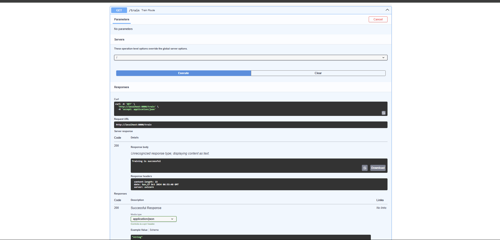
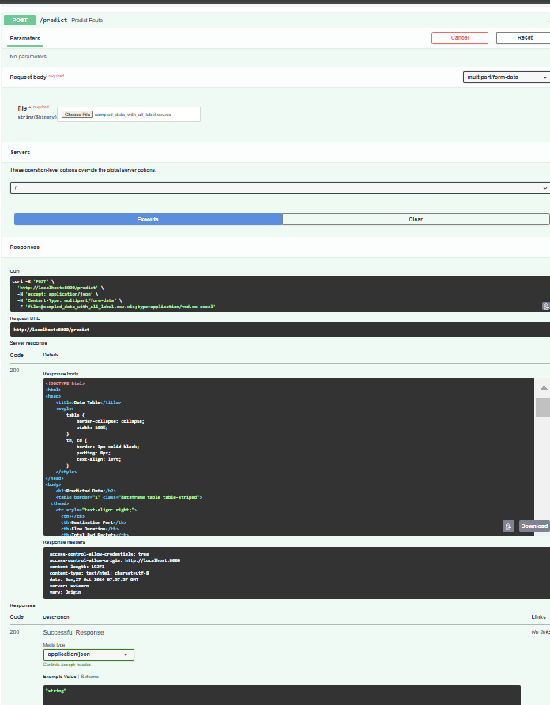

# Network Intrusion Detection System

### Project Overview

Network Intrusion Detection System (NIDS) designed to analyze network traffic and identify potential security threats in real-time. Built as a scalable machine learning pipeline, NIDSt supports AWS deployment and leverages hyperparameter-tuned models for optimal performance. It includes stages for data ingestion, validation, transformation, and model training, with endpoints for initiating training and making predictions via REST API.

### Features

* **Data Ingestion** : Converts network data from CSV to JSON and stores it in MongoDB for accessibility.
* **Data Validation and Transformation** : Ensures data integrity and prepares it for model training.
* **Model Training with Hyperparameter Tuning** : Utilizes machine learning algorithms with optimized hyperparameters to detect intrusions and evaluates them on key metrics (e.g., F1 score, precision, recall).
* **AWS Deployment Ready** : Configured for scalable deployment on Amazon Web Services.
* **REST API** : FastAPI-based endpoints for model training (`/train`) and prediction (`/predict`).
* **Docker Support** : Containerized with Docker for consistent, environment-agnostic deployment.
* **Logging and Error Handling** : Centralized logging and custom exception handling for improved reliability.
* **Automated Data Processing** : Modularized components handle data ingestion, validation, transformation, and model training.

### Pipeline Workflow

The workflow of this project is based on modular components that execute sequentially:

1. **Data Ingestion** :

* Loads data from a specified source, typically a CSV or database.
* Splits data into training and testing sets.

1. **Data Validation** :

* Verifies that ingested data adheres to the predefined schema (`schema.yaml`).
* Ensures data quality and integrity before further processing.

1. **Data Transformation** :

* Cleans and preprocesses data (e.g., scaling, encoding).
* Stores transformed data for input into the model.

1. **Model Training** :

* Trains a machine learning model to detect anomalies in network traffic.
* Saves the trained model and preprocessor for later use.

### Project Structure

* **`app.py`** : The main application file for running the detection system.
* **`main.py`** : Initializes and runs the training pipeline, handling ingestion, validation, transformation, and model training.
* **`networksecurity/`** : Core modules for the NIDS functionality.
* `components/`: Contains data ingestion, transformation, validation, and model training scripts.
* `entity/`: Contains configuration and artifact entities.
* `exception/`: Defines custom exceptions for improved error handling.
* `logging/`: Manages logging across the application.
* `pipeline/`: Contains training and batch prediction pipeline scripts.
* `utils/`: Various utility functions for main and machine learning processes.
* **`Artifacts/`** : Stores the output of different stages (ingested data, transformed data, validation results).
* **`data_schema/schema.yaml`** : Defines the data schema for validating input data.
* **`requirements.txt`** : Lists all dependencies required to run the project.
* **`Dockerfile`** : Configuration for Docker, allowing the project to be containerized.
* **`README.md`** : Documentation for setting up and understanding the project.
* **`logs/`** : Stores application logs.
* **`final_model/`** : Contains the final trained model and preprocessor.

### Key Files and Their Functions

1. **`main.py`** : Initializes the pipeline and handles logging.
2. **`networksecurity/components/`** :

* `data_ingestion.py`: Defines the `DataIngestion` class for fetching and splitting data.
* `data_validation.py`: Contains `DataValidation` to validate input data.
* `data_transformation.py`: Transforms raw data to the format expected by the model.
* `model_trainer.py`: Manages the model training, saving the best model for prediction.

1. **`networksecurity/entity/`** :

* `config_entity.py` and `artifact_entity.py`: Define configurations and artifacts passed between pipeline stages.

1. **`networksecurity/pipeline/training_pipeline.py`** : Combines all pipeline stages to create a trainable pipeline.

### Algorithms Used

1. **Random Forest Classifier**
   * **Description** : An ensemble learning method that constructs multiple decision trees and merges them to improve the overall prediction accuracy and control overfitting.
   * **Hyperparameters** :
   * `n_estimators`: Number of trees in the forest. Options include `[50, 100, 200]`.
   * `max_features`: The number of features to consider when looking for the best split. Options include `["auto", "sqrt"]`.
   * `max_depth`: Maximum depth of the tree. Options include `[10, 20, 30, None]`.
   * `min_samples_split`: Minimum number of samples required to split an internal node. Options include `[2, 5, 10]`.
2. **Decision Tree Classifier**
   * **Description** : A tree-like model that makes decisions based on the feature values, effectively creating a flowchart-like structure to guide predictions.
   * **Hyperparameters** :
   * `criterion`: The function to measure the quality of a split. Options include `["gini", "entropy"]`.
   * `max_depth`: Maximum depth of the tree. Options include `[10, 20, 30, None]`.
   * `min_samples_split`: Minimum number of samples required to split an internal node. Options include `[2, 5, 10]`.
3. **Gradient Boosting Classifier**
   * **Description** : An ensemble method that builds models sequentially, with each new model attempting to correct errors made by the previous ones, making it effective for both regression and classification problems.
   * **Hyperparameters** :
   * `n_estimators`: Number of boosting stages to be run. Options include `[50, 100, 200]`.
   * `learning_rate`: Step size for each iteration. Options include `[0.01, 0.1, 0.2]`.
   * `max_depth`: Maximum depth of the individual estimators. Options include `[3, 5, 7]`.
4. **Logistic Regression**
   * **Description** : A statistical model that uses a logistic function to model a binary dependent variable. It's widely used for binary classification tasks.
   * **Hyperparameters** :
   * `C`: Inverse of regularization strength; smaller values specify stronger regularization. Options include `[0.1, 1.0, 10.0]`.
   * `solver`: Algorithm to use for optimization. Options include `["liblinear", "lbfgs"]`.
5. **AdaBoost Classifier**
   * **Description** : An ensemble learning method that combines multiple weak classifiers to create a strong classifier. Each classifier focuses more on the misclassified instances from the previous classifiers.
   * **Hyperparameters** :
   * `n_estimators`: Number of weak classifiers to be combined. Options include `[50, 100, 200]`.
   * `learning_rate`: Weight applied to each classifier at each boosting iteration. Options include `[0.01, 0.1, 0.2]`.

### Hyperparameter Tuning Process

To ensure that each model operates at its highest performance level, a hyperparameter tuning process is employed. This typically involves the following steps:

1. **Grid Search** : A systematic approach where multiple combinations of hyperparameters are evaluated. Each combination is tested using cross-validation to gauge model performance based on a specified metric (e.g., accuracy, F1 score).
2. **Random Search** : This method randomly samples from the hyperparameter space, allowing for a wider exploration of parameter combinations within a shorter time frame.
3. **Evaluation Metrics** : Models are assessed using key metrics, including:

* **F1 Score** : A balance between precision and recall, providing a better measure of the incorrectly classified cases than accuracy.
* **Precision** : The ratio of correctly predicted positive observations to the total predicted positives.
* **Recall** : The ratio of correctly predicted positive observations to all actual positives.

## API Endpoints

### 1. **Train the Model**

* **Endpoint** : `GET /train`
* **Description** : Initiates the model training pipeline.
* **Response** : Confirms successful training or returns an error if the process fails.

### 2. **Make Predictions**

* **Endpoint** : `POST /predict`
* **Description** : Accepts a CSV file containing network data and returns predictions.
* **Request Parameter** :
* `file`: CSV file containing network traffic data.
* **Response** : HTML table with predictions for each record.

### Output

Training

Prediction

